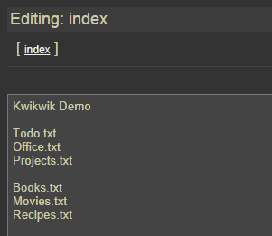

# Kwikwik

* Fills the gap between loose text files and excessive wikis.
* A lightweight stand-alone wiki, providing text files with links.
* A stand-alone http server/app.
* Serves .txt files from a subdirectory.
* The name of any .txt files mentioned inside a text file will be converted to a hyperlink.

---
#### Status: Useful.
---

## Screenshots

## License
BSD 3-Clause: [LICENSE.txt](LICENSE.txt)

